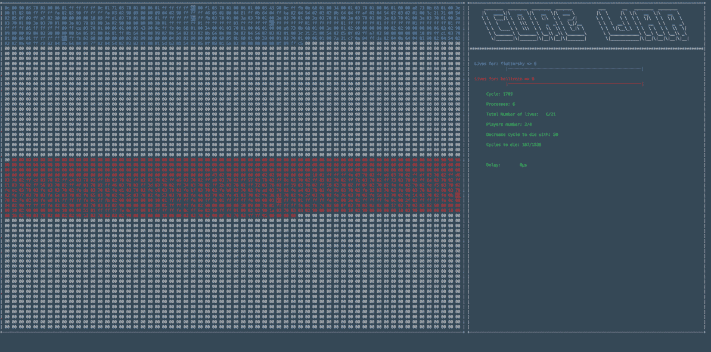

# corewar
Corewar is a codding game from 1984
 

Current implementation according according to school "42" corewar specifications. 

Players are programmed using the assembler style language inspired by the <a href="http://vyznev.net/corewar/guide.html"> original redcode</a>. 

Usage: 
Create program using set of instruction below. file must start with: 
*.name "player_name"* 
*.comment "comments to the player"* 
*\# comment can be placed anywhere and must be followed by the number sign '#'* 
*set of instructions* 

Program file must end by .s. 

### assembly language instructions

| instructions | op codes | arguments                | purpose  | cycles | modify carry | pre-load opcode |
